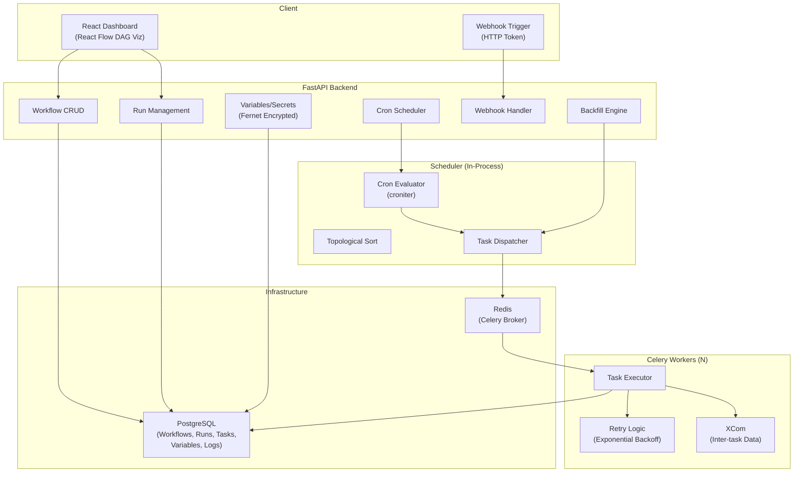

<p align="center">
  <h1 align="center">Distributed Workflow Engine</h1>
  <p align="center">
    Production-grade distributed workflow engine with DAG-based task orchestration, cron scheduling, retry logic, and a React dashboard — inspired by Apache Airflow, built for simplicity.
  </p>
</p>

<p align="center">
  
  
  
  
  
  
  
  
</p>

---

## Overview

A lightweight yet full-featured workflow orchestration engine. Define workflows using a Python DSL with the `>>` chaining operator, schedule them via cron expressions, and let Celery workers execute tasks in dependency order with retries and exponential backoff. The React dashboard (powered by React Flow) provides interactive DAG visualization, run history, and live task logs. Includes encrypted variable/secret storage, webhook triggers, inter-task data passing (XCom), and backfill support.

## Architecture



## Features

| Feature | Description |
|---------|-------------|
| **DAG Definition** | Python DSL with `>>` operator for intuitive task chaining |
| **Dependency Scheduling** | Topological sort with parallel execution of independent tasks |
| **Celery Workers** | Distributed task execution with configurable concurrency |
| **Retry Logic** | Per-task retries with exponential backoff |
| **Cron Scheduling** | Periodic workflow execution via cron expressions (croniter) |
| **Task State Machine** | `pending -> queued -> running -> success / failed / retry` |
| **React Dashboard** | Interactive DAG visualization (React Flow), run history, live logs |
| **REST API** | Full CRUD, trigger runs, backfill, manage schedules |
| **Variables & Secrets** | Fernet-encrypted key-value store for config and credentials |
| **Webhooks** | Trigger workflows via HTTP token + completion callbacks |
| **XCom** | Inter-task data passing (return values stored as JSON) |
| **Backfill** | Re-run workflows for historical date ranges |

## Quick Start

### Docker Compose (recommended)

```bash
cd docker
docker compose up --build
```

| Service | URL |
|---------|-----|
| API (Swagger) | http://localhost:8000/docs |
| Frontend | http://localhost:3000 |
| PostgreSQL | localhost:5432 |
| Redis | localhost:6379 |

### Local Development

```bash
# Backend
cd backend
python -m venv .venv && source .venv/bin/activate
pip install -r requirements.txt
uvicorn app.main:app --reload

# Celery worker (separate terminal)
celery -A app.core.celery_app:celery_app worker --loglevel=info

# Frontend
cd frontend
npm install && npm run dev
```

## DAG DSL Example

```python
from app.dsl.dag import DAG, Task

with DAG("etl_pipeline", cron_schedule="0 2 * * *") as dag:
    extract = Task(task_id="extract", callable_name="builtin.echo",
                   kwargs={"message": "Extracting..."})
    dag.add_task(extract)

    transform = Task(task_id="transform", callable_name="builtin.echo",
                     kwargs={"message": "Transforming..."})
    dag.add_task(transform)

    load = Task(task_id="load", callable_name="builtin.echo",
                kwargs={"message": "Loading..."})
    dag.add_task(load)

    extract >> transform >> load  # Define dependencies
```

## API Reference

### Workflows

```bash
# Create a workflow
curl -X POST http://localhost:8000/api/v1/workflows \
  -H "Content-Type: application/json" \
  -d '{
    "name": "my_pipeline",
    "dag_definition": {
      "tasks": [
        {"task_id": "step1", "callable_name": "builtin.echo", "kwargs": {"message": "hello"}, "depends_on": []},
        {"task_id": "step2", "callable_name": "builtin.add", "kwargs": {"a": 1, "b": 2}, "depends_on": ["step1"]}
      ]
    }
  }'

# Trigger a run
curl -X POST http://localhost:8000/api/v1/workflows/{id}/runs

# Check run status
curl http://localhost:8000/api/v1/workflows/runs/{run_id}

# View task logs
curl http://localhost:8000/api/v1/workflows/tasks/{task_instance_id}/logs
```

### Scheduling & Backfill

```bash
# Create a cron schedule
curl -X POST http://localhost:8000/api/v1/workflows/{id}/schedules \
  -H "Content-Type: application/json" \
  -d '{"cron_expression": "*/5 * * * *"}'

# Backfill historical date range
curl -X POST http://localhost:8000/api/v1/workflows/{id}/backfill \
  -H "Content-Type: application/json" \
  -d '{"start_date": "2024-01-01T00:00:00Z", "end_date": "2024-01-07T00:00:00Z", "interval": "1d"}'
```

### Variables & Secrets

```bash
curl -X POST http://localhost:8000/api/v1/variables \
  -H "Content-Type: application/json" \
  -d '{"key": "DB_HOST", "value": "prod-db.example.com", "is_secret": false}'
```

## Project Structure

```
workflow-engine/
├── backend/
│   ├── app/
│   │   ├── main.py                # FastAPI app entry point
│   │   ├── api/
│   │   │   └── endpoints/         # REST routes (workflows, schedules, webhooks, variables)
│   │   ├── core/
│   │   │   ├── config.py          # Settings (Pydantic BaseSettings)
│   │   │   ├── database.py        # Async SQLAlchemy setup
│   │   │   ├── celery_app.py      # Celery configuration
│   │   │   └── security.py        # Fernet encryption for secrets
│   │   ├── dsl/
│   │   │   └── dag.py             # DAG and Task DSL (>> operator)
│   │   ├── models/
│   │   │   └── workflow.py        # SQLAlchemy ORM (Workflow, Run, TaskInstance, Variable)
│   │   ├── schemas/
│   │   │   └── workflow.py        # Pydantic request/response schemas
│   │   ├── services/              # Scheduler, webhook service
│   │   └── tasks/
│   │       └── executor.py        # Celery task executor (state machine, retries, XCom)
│   ├── migrations/                # Alembic database migrations
│   ├── tests/                     # Pytest suite
│   └── Dockerfile
├── frontend/
│   ├── src/
│   │   ├── components/            # DAGVisualization (React Flow), StateBadge
│   │   ├── pages/                 # WorkflowList, WorkflowDetail, RunDetail
│   │   ├── api/                   # Axios API client
│   │   └── App.tsx
│   └── Dockerfile
├── docker/
│   └── docker-compose.yml         # Full stack (API, worker, frontend, PG, Redis)
├── scripts/                       # Utility scripts
└── Makefile
```

## Tech Stack

| Component | Technology |
|-----------|-----------|
| API | FastAPI (async), Python 3.11+ |
| Task Queue | Celery + Redis |
| Database | PostgreSQL + SQLAlchemy 2.0 (async) + Alembic |
| Frontend | React 18, TypeScript, Tailwind CSS |
| DAG Visualization | @xyflow/react (React Flow) |
| Encryption | cryptography (Fernet) |
| Cron Parsing | croniter |
| Containerization | Docker Compose |

## License

MIT
